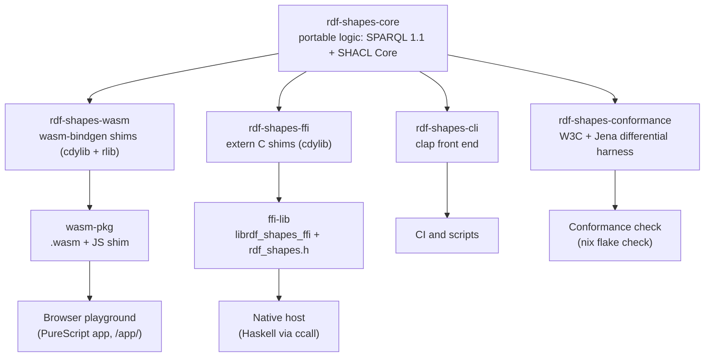

# rdf-shapes-wasm

Portable SPARQL 1.1 + SHACL Core engine compiled to WebAssembly, for
querying and validating RDF tx-graphs in the browser, on the server, and
in CI.

## What is this

One Rust core (`rdf-shapes-core`) implements full **SPARQL 1.1** query
([Oxigraph](https://github.com/oxigraph/oxigraph)) and **SHACL Core**
validation ([rudof](https://github.com/rudof-project/rudof)) over
in-memory Turtle, and ships to **multiple targets from one source**:

- **browser wasm** — a reproducible `wasm-bindgen` bundle (client-side,
  no server),
- **native FFI lib** — a C-ABI shared library for native hosts (e.g. a
  Haskell server via `foreign import ccall`),
- **native CLI** — the self-contained `rdf-shapes` binary.

It replaces JVM/Apache-Jena CLI dependencies for querying and validating
RDF transaction graphs. Jena stays in the picture only as a
*differential oracle*: the conformance harness runs the same inputs
through both engines and asserts parity — see
[`docs/conformance.md`](docs/conformance.md).

Everything is built and tested with Nix; `nix flake check` is the single
gate, identical locally and in CI. The `.wasm` is byte-reproducible: two
clean builds yield an identical artifact.

- **Docs:** <https://lambdasistemi.github.io/rdf-shapes-wasm/>
- **Live playground:** <https://lambdasistemi.github.io/rdf-shapes-wasm/app/>

## Architecture



| Crate | Role |
|---|---|
| `rdf-shapes-core` | Portable core logic. Builds native **and** `wasm32`; no `wasm-bindgen`, no I/O. All logic lives here. |
| `rdf-shapes-wasm` | `cdylib` + `rlib`. Thin `#[wasm_bindgen]` shims over the core (browser). |
| `rdf-shapes-ffi` | `cdylib`. Thin `extern "C"` shims over the core (native server / Haskell). |
| `rdf-shapes-cli` | Native `rdf-shapes` binary. Thin `clap` front end over the core. |
| `rdf-shapes-conformance` | Native-only conformance and Jena differential harness (test infrastructure, not shipped). |

The core exposes `query` (full SPARQL 1.1, via Oxigraph) and `validate`
(SHACL Core, via rudof) over in-memory Turtle; the wasm, FFI, and CLI
shells marshal those to and from JSON. The browser
[playground](https://lambdasistemi.github.io/rdf-shapes-wasm/app/) (a
PureScript/Halogen app under `app/`) runs the wasm bundle entirely
client-side. See [`docs/usage.md`](docs/usage.md) and
[`docs/architecture.md`](docs/architecture.md).

## Install

Pre-built, Nix-reproducible artifacts ship with each
[GitHub release](https://github.com/lambdasistemi/rdf-shapes-wasm/releases):

- `rdf-shapes-<version>-cli.tar.gz` — the native CLI binary,
- `rdf-shapes-wasm-<version>.tgz` — the npm-shaped wasm package,
- `rdf_shapes_wasm_bg.wasm` — the bare optimized wasm module,
- `rdf-shapes-ffi-<system>.tar.gz` — the native C-ABI library + header,
- `SHA256SUMS` — checksums over all of the above.

Or build from source with Nix:

```bash
nix build .#cli      # → ./result/bin/rdf-shapes
```

## Quickstart

Count the transactions in a small Turtle graph with the CLI:

```bash
nix build .#cli

cat > graph.ttl <<'EOF'
@prefix cardano: <https://lambdasistemi.github.io/cardano-ledger-rdf/vocab/cardano#> .
<urn:tx:aaaa> a cardano:Transaction .
<urn:tx:bbbb> a cardano:Transaction .
<urn:tx:cccc> a cardano:Transaction .
EOF

cat > tx-count.rq <<'EOF'
PREFIX cardano: <https://lambdasistemi.github.io/cardano-ledger-rdf/vocab/cardano#>
SELECT (COUNT(DISTINCT ?tx) AS ?transactions)
WHERE { ?tx a cardano:Transaction . }
EOF

./result/bin/rdf-shapes query --graph graph.ttl --query tx-count.rq
```

This prints the SPARQL 1.1 Query Results JSON with the count bound to
`"3"` as a typed `xsd:integer` literal. Validation works the same way:
`rdf-shapes validate --data data.ttl --shapes shapes.ttl` prints a
`{"conforms": …, "violations": […]}` report. No install at all: paste
the same Turtle and query into the
[playground](https://lambdasistemi.github.io/rdf-shapes-wasm/app/).

## Usage

The CLI has two subcommands, both printing pretty JSON to stdout:

```bash
rdf-shapes query    --graph <graph.ttl> --query <query.rq>
rdf-shapes validate --data <data.ttl>   --shapes <shapes.ttl>
```

[`docs/usage.md`](docs/usage.md) documents the result shapes, the wasm
and FFI surfaces, and the smoke harnesses.

### Downstream reuse

The two reuse contracts are flake outputs, so a downstream project
consumes them by adding this repo as a flake input and referencing the
package for its system. Both are Nix-built and verified consumable.

**Browser wasm (`wasm-pkg`)** — the npm-shaped bundle:
`rdf_shapes_wasm.js` (the `wasm-bindgen` JS shim) and
`rdf_shapes_wasm_bg.wasm`, plus TypeScript types and a `package.json`.

```nix
{
  inputs.rdf-shapes-wasm.url = "github:lambdasistemi/rdf-shapes-wasm";

  outputs = { self, nixpkgs, rdf-shapes-wasm, ... }:
    let
      system = "x86_64-linux";
      wasm = rdf-shapes-wasm.packages.${system}.wasm-pkg;
    in {
      # `${wasm}` contains rdf_shapes_wasm.js + rdf_shapes_wasm_bg.wasm;
      # copy them into your web bundle at build time.
    };
}
```

```js
import init, { start, query, validate } from "./rdf_shapes_wasm.js";
await init();
start();
const result = query(graphTtl, sparql);
const report = validate(dataTtl, shapesTtl);
```

**Native FFI lib (`ffi-lib`)** — the C-ABI shared library
(`lib/librdf_shapes_ffi.{so,dylib}`) plus the cbindgen-generated
`include/rdf_shapes.h`, consumed from Haskell via `foreign import ccall`
(verified on GHC 9.12.3). This is the **server** reuse path: the engine
runs natively in-process, not on a wasm host.

```nix
{
  inputs.rdf-shapes-wasm.url = "github:lambdasistemi/rdf-shapes-wasm";

  outputs = { self, nixpkgs, rdf-shapes-wasm, ... }:
    let
      system = "x86_64-linux";
      ffi = rdf-shapes-wasm.packages.${system}.ffi-lib;
    in {
      # `${ffi}/lib/librdf_shapes_ffi.so` links into the Haskell server;
      # `${ffi}/include/rdf_shapes.h` is the matching C header.
    };
}
```

```haskell
foreign import ccall "rdf_shapes_query"
  rdf_shapes_query :: CString -> CString -> IO CString
```

Each FFI function returns a JSON envelope — `{"ok": <result>}` on
success, `{"error": "<message>"}` on failure — and the caller frees the
returned string with `rdf_shapes_string_free`. See
[`crates/rdf-shapes-ffi/smoke`](crates/rdf-shapes-ffi/smoke) for the GHC
9.12.3 `ccall` proof.

## Documentation

- **Site:** <https://lambdasistemi.github.io/rdf-shapes-wasm/> —
  concepts, architecture, conformance, usage, the live playground, and
  the rustdoc API reference (co-hosted under `/api/`).
- For AI agents, start at [AGENTS.md](AGENTS.md).

## Development

Everything runs through Nix, so the gate is identical locally and in CI.

| Command | What it does |
|---|---|
| `nix flake check` | The single gate: clippy (`-D warnings`), rustfmt, nextest, cargo-deny, rustdoc (`-D warnings`), the conformance harness, and the playground check. |
| `just ci` | The CI gate via `nix run .#ci`: builds every package plus the clippy/fmt/nextest/deny/doc/conformance checks. |
| `just conformance` | Run the Apache Jena differential and curated W3C conformance harness. |
| `nix build .#cli` | Native CLI; run `./result/bin/rdf-shapes --help`. |
| `nix build .#wasm-pkg` | Reproducible, npm-shaped wasm bundle (pinned `wasm-bindgen-cli` + `wasm-opt -Oz`). |
| `nix build .#ffi-lib` | Native C-ABI shared library: `lib/librdf_shapes_ffi.{so,dylib}` + `include/rdf_shapes.h` (cbindgen-generated). |
| `nix build .#playground` | The browser playground bundle (`dist/{index.html,index.js}`). |
| `nix build .#release-artifacts` | CLI tarball + npm `.tgz` + bare `.wasm` + native FFI lib tarball + `SHA256SUMS`. |

The `.wasm` is reproducible: two clean builds of `.#wasm-pkg` yield a
byte-identical artifact. The `wasm-bindgen` library version is locked to
the pinned `wasm-bindgen-cli` (see `Cargo.toml` and `flake.nix`).

### Releasing

Releases are **tag-driven** and reproducible — no release-please (the
repo is a virtual cargo workspace with an inherited version, which
release-please can't manage cleanly). To cut `vX.Y.Z`:

```bash
just release X.Y.Z          # bumps [workspace.package].version + Cargo.lock,
                            # stamps a CHANGELOG section, commits chore(release)
# edit the CHANGELOG entry, open + merge a PR for that commit, then:
git tag vX.Y.Z && git push origin vX.Y.Z
```

Pushing the `v*` tag runs `.github/workflows/release.yml`, which builds
`.#release-artifacts` with Nix and publishes the GitHub release (CLI
tarball, npm `.tgz`, bare `.wasm`, native FFI lib tarball, `SHA256SUMS`).
The npm publish step is a no-op until an `NPM_TOKEN` secret is set.

## License

[Apache-2.0](./LICENSE)
